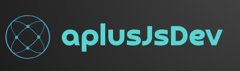

# Hi, I'm Aplus! 👋

  
<h2>&emsp;&emsp;&emsp;&emsp;&emsp;&emsp;&emsp;I'm a software engineer student</h2>

## 🚀 About Me
<b>

&emsp;&emsp;&emsp;&emsp;&emsp;&emsp;&emsp;🔭 I’m currently working on React Js &emsp;&emsp;&emsp;&emsp;&emsp;&emsp;&emsp;👯 I’m looking to collaborate on React projects &emsp;&emsp;&emsp;&emsp;&emsp;&emsp;&emsp;🌱 I’m currently learning python 
</b>

## 🌐 Socials:

    

# 💻 Tech Stack:

  
         

# 📊 GitHub Stats:

 
 

### 🔝 Top Contributed Repo

  

---

